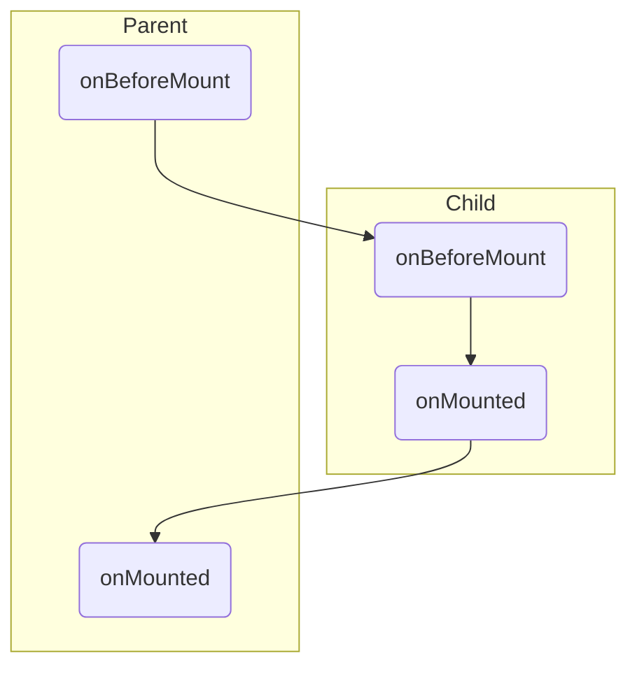

---

layout: post
title: "Vue3"
date: 2021-01-18

---



# SFC

Any **top-level** bindings (including `variables`, `function declarations`, and `imports`) declared inside `<script setup>` are directly usable in the `template`:

```html
<template>
  <div @click="log">{{ msg }}</div>
</template>
<script setup>
const msg = 'Hello!'

// functions
function log() {
  console.log(msg)
}
</script>
```

## `defineProps` and `defineEmits`

`defineProps` and `defineEmits` are **compiler macros**

```html
<script setup>
const props = defineProps({
  foo: String
})

const emit = defineEmits(['change', 'delete'])
// setup code
</script>
```

ES Lint Config:

```js
module.exports = {
  // ...
  globals: {
    defineProps: "readonly",
    defineEmits: "readonly",
    defineExpose: "readonly",
    withDefaults: "readonly"
  }
}
```

# Teleport

```html
<button @click="modalOpen = true">
    Open full screen modal! (With teleport!)
</button>

<teleport to="body">
  <div v-if="modalOpen" class="modal">
    <div>
      I'm a teleported modal! 
      (My parent is "body")
      <button @click="modalOpen = false">
        Close
      </button>
    </div>
  </div>
</teleport>
```

```js
// 传送至 body
import { createVNode, h, render, Teleport } from 'vue';
render(
  createVNode(h(Teleport, { to: 'body' }, ['hello'])),
  document.createDocumentFragment() as any
);
```

# Functional

```js
function MyComponent(props, context) {
  // ...
}
```

# Reactivity

- `targetMap` - `WeakMap` 
  + key: Reactive Object
  + value: `depMap`
    * key: propName
    * value
      * `dep` - `Set` of effects


```js
function reactive(target) {
  const handler = {
    get(target, key, receiver) {
      let result = Reflect.get(target, key, receiver);
      // track
      return result;
    },
    set(target, key, value, receiver) { // receiver ensures the proper value of `this`
      let oldValue = target[key];
      let result = Reflect.set(target, key, value, receiver);
      if (result && oldValue != value) {
        // trigger
      }
    }
    return new Proxy(target, handler);
  }
}
```

## reactive()

The reactive conversion is **"deep"**: it affects all nested properties. 

A reactive object also deeply unwraps any properties that are `refs` while maintaining reactivity.

```js
// !! no ref unwrapping performed, also native collection type like `Map`.
const reactiveA = reactive([ref(1), ref(2)]);
 
console.log(reactiveA[0].value) // 1
```
# Lifecycle



# Debug

```js
$vm0.setupState

$vm0.setupContext
```

# Pinia

`store` is an object wrapped with `reactive`, can't destructure!

```js
import { storeToRefs } from 'pinia'

const { name, doubleCount } = storeToRefs(useCounterStore());
```

- state
- getters
- actions

# VueUse

Collection of Vue Composition Utilities

> <https://vueuse.org>

Most of the functions in VueUse returns an object of `refs` that you can use ES6's object destructure syntax to take what you need.

```js
// "x" and "y" are refs
const { x, y } = useMouse()
```

If you prefer to use them as object properties style, you can unwrap the refs by using `reactive()`.

```js
const mouse = reactive(useMouse())

// "x" and "y" will be auto unwrapped, no `.value` needed
console.log(mouse.x)
```

## useMemoize